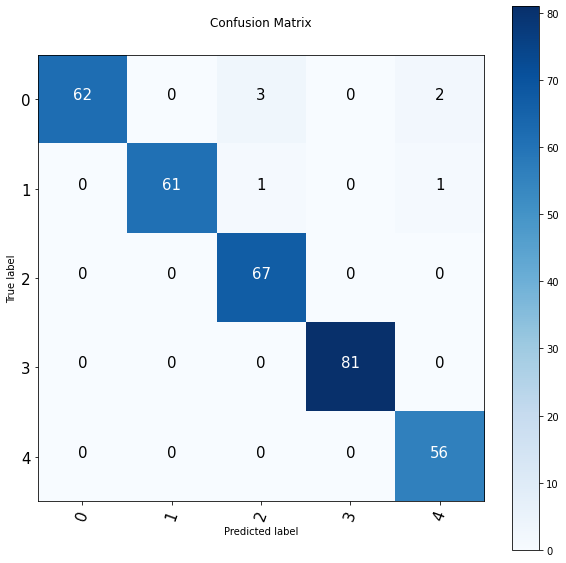
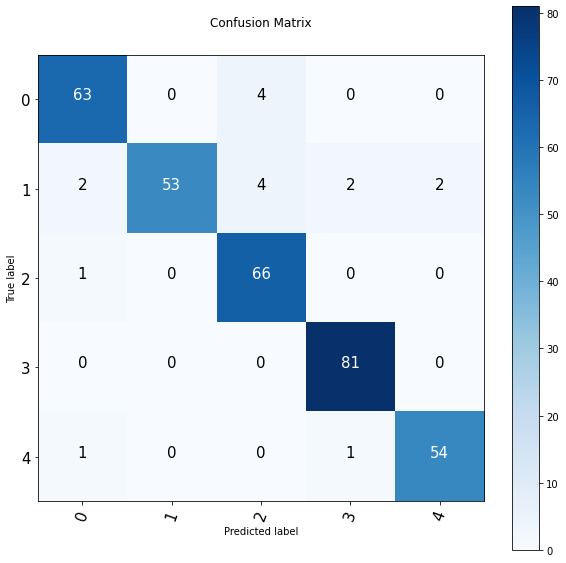

# Natural Language Processing (NLP):

## Project 1: BBC Dataset

### Introduction:
The objective of this project is to classify the BBC text data into five distinct categories.

### Methodology:
The classification process is carried out using both machine learning and deep learning models. Initially, a baseline machine learning model was implemented using the scikit-learn library. Subsequently, the baseline performance was improved using deep neural network architectures like LSTM and Dense models, which were implemented using TensorFlow. Lastly, the Universal-Sentence-Encoder from TensorFlow Hub was employed as a pre-trained model.

### Results:
The results of the four models were compared, and the accuracy was assessed using a confusion matrix. It was observed that the Dense model and Universal-Sentence-Encoder showed the highest accuracy. The baseline model performed well, with an accuracy of around 94%. On the other hand, the LSTM model did not perform efficiently on this dataset.

Universal-Sentence-Encoder::

Only 7 false predictions

Dense Model::

9 false predictions

SKlearn Base Model::

17 false predictions

### Conclusion:
Based on the results, it can be concluded that the Dense model and Universal-Sentence-Encoder were the most effective models in classifying the BBC text data. The baseline model showed good performance, but the LSTM model was not suitable for this dataset.
